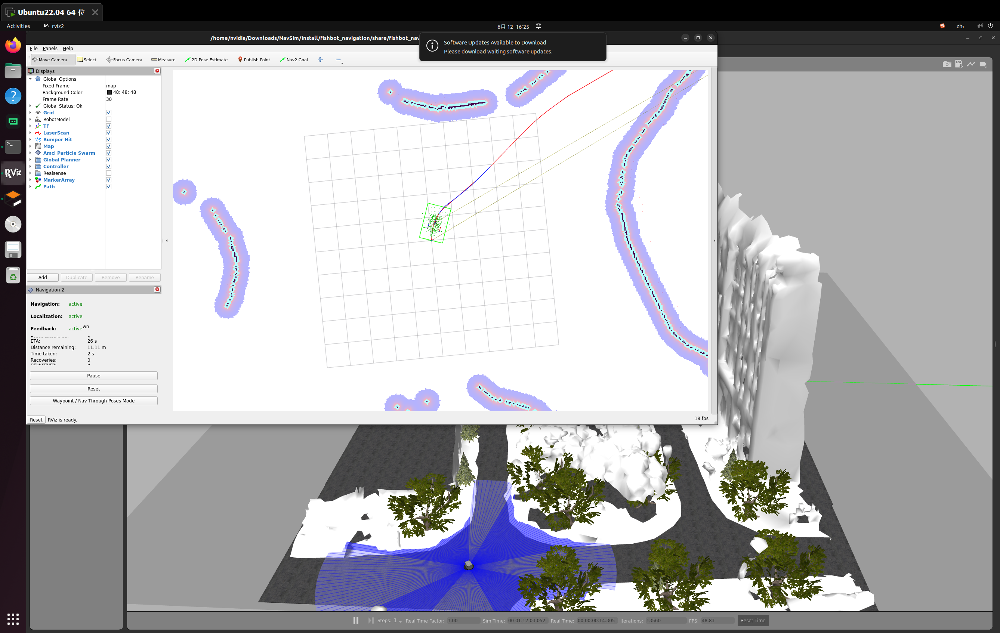
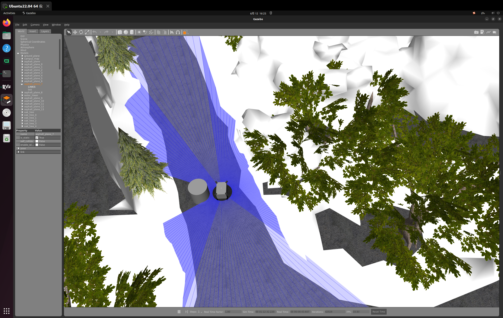
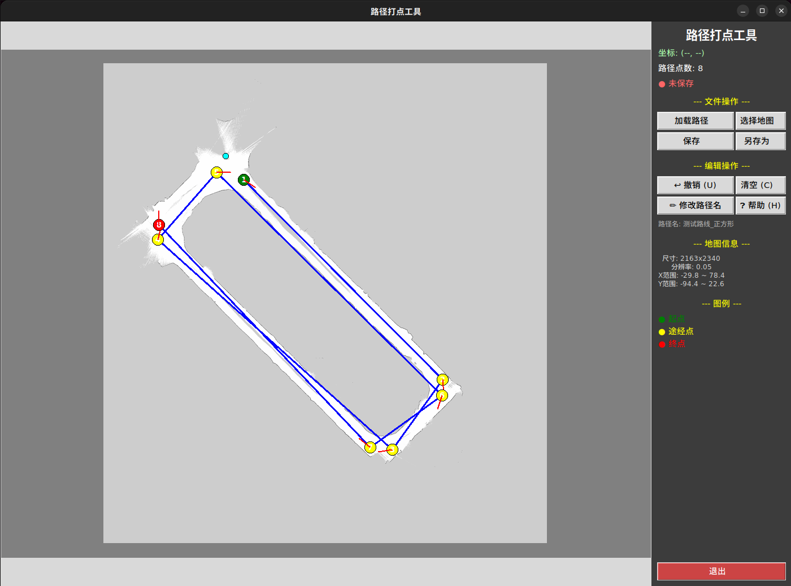

# NavSim — 无人车导航仿真

> 🏆 第十一届江苏大学生交通科技大赛 **一等奖**

## 🎬 演示视频

> **[▶ 点击观看演示视频](https://github.com/AGI-FBHC/NavSim/releases/download/v1.0/test_video.mp4)**

## 📖 项目简介

NavSim 是一个基于 **ROS2 Humble + Nav2 + Gazebo** 的三轮阿克曼底盘无人车导航仿真系统。项目提供了完整的仿真验证环境，支持路径规划、自主避障、覆盖式清扫等核心功能，可在部署实车前完成算法调试与场景测试。

## ✨ 核心特性

- **多种导航规划器** — 支持 TEB、DWB 等局部规划器，适配阿克曼底盘运动学约束
- **自主避障** — 基于 Costmap 的实时障碍物检测与动态绕行
- **路径工具链** — 提供 GUI 路径打点、终端路径编辑、弓字形覆盖路径生成等工具
- **一键启动** — 仿真环境 + 导航栈 + RViz 可视化，一条命令即可运行
- **实景地图** — 支持基于真实环境建图（Cartographer SLAM）的仿真验证

## 🚀 效果展示

### 自主导航与避障

### GUI 路径规划工具

## 🛠 技术栈

| 组件 | 技术 |
|------|------|
| 机器人操作系统 | ROS2 Humble |
| 仿真引擎 | Gazebo |
| 导航框架 | Nav2 |
| SLAM 建图 | Cartographer |
| 局部规划器 | TEB / DWB |
| 可视化 | RViz2 |
| 底盘类型 | 三轮阿克曼转向 |

## 🚗 应用场景

三轮阿克曼底盘凭借转弯半径小、结构简单、成本低的特点，适用于多种低速场景：

| 场景 | 说明 |
|------|------|
| 🧹 环卫清扫 | 市政道路、园区广场的无人清扫车，覆盖式路径规划 + 自主避障 |
| 📦 末端物流 | 社区、校园内的无人配送车，半结构化环境点到点导航 |
| 🌾 农业作业 | 农田喷洒、巡检机器人，沿预设路线高精度行驶 |
| 🔍 园区巡检 | 工厂、景区安防巡逻车，按固定路线自主巡航 |
| 🏠 室内清洁 | 商场、仓库地面清洁机器人，障碍物间灵活穿行 |

## 🗺 地图与路径

项目内置多张地图与预定义路径，覆盖基础测试与实景仿真需求：

- **基础地图** — 简单环境，适合算法验证
- **实景校园地图** — 基于真实环境建图，用于比赛场景仿真
- **预定义路径** — 比赛路线、弓字形覆盖、方形测试等多种路径方案

---

  Made with ❤️ by AGI&FBHC

